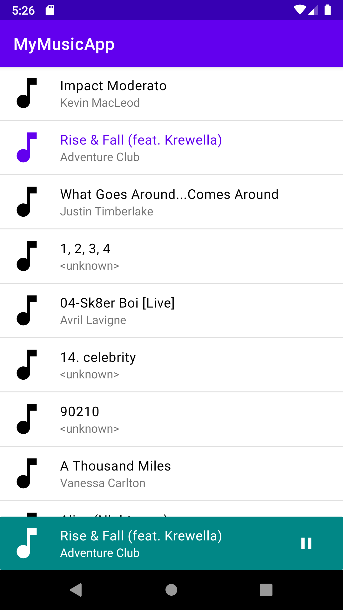
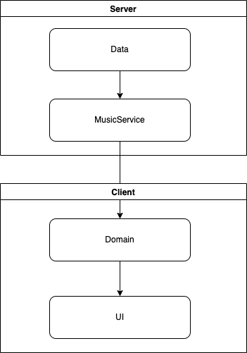
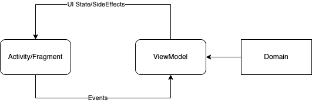

# My Simple Music Player

The goal of this project is to demonstrate an implementation of a music player in android using the MVI (Model View Intent) architecture.

The application uses a client/server design as defined in the [official docs](https://developer.android.com/guide/topics/media-apps/audio-app/building-an-audio-app)

 

# Architecture overview

The following diagram illustrates the overall client/server architecture of the application.

## Server
The server contains the data layer and the music service which is responsible for providing the data for the UI and playing the audio.

### Data
The data layer uses the repository pattern.  The [repository](https://github.com/nak411/MyMusicApp/blob/main/app/src/main/java/com/naveed/mymusicapp/core/data/api/MusicRepositoryImpl.kt) is responsible for managing the different data source.  There is currently a single local data source which provides access to the audio files stored on the device.

### Music Service
The music service is implemented using a foreground service.  This service serves as the server and allows the client to connect to it.  This allows the music to play even when the user has backed out of the application.

## Client
The client is responsible binding with the service and providing the UI.

### Domain
The domain consists of multiple use cases.  A single use case is reponsible for a single action.  The UI layer only knows about the domain layer. 
The domain layer uses the service to serve the data to the client and also acts as a mediator for controlling the service.

The following diagram illustrates the client architecture:

A state object is used to mutate and display the UI.  Any user interaction is tracked using an `Event` which is then sent to the view model and sent to the domain layer for processing.  This creates the full event loop and maintains uni-directional data flow.

